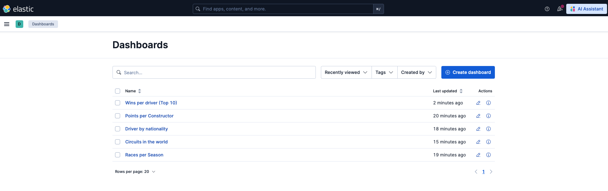
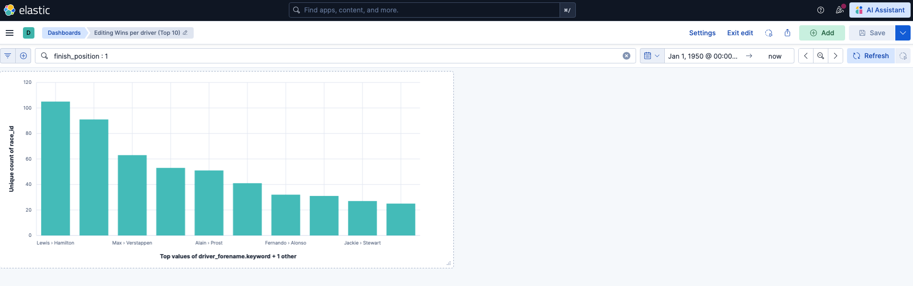
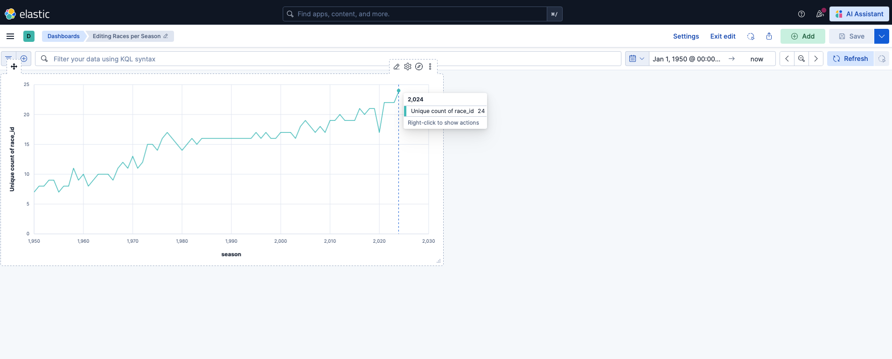
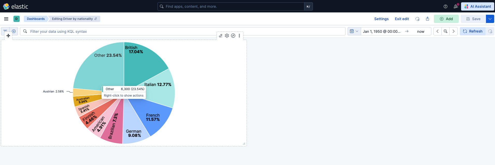
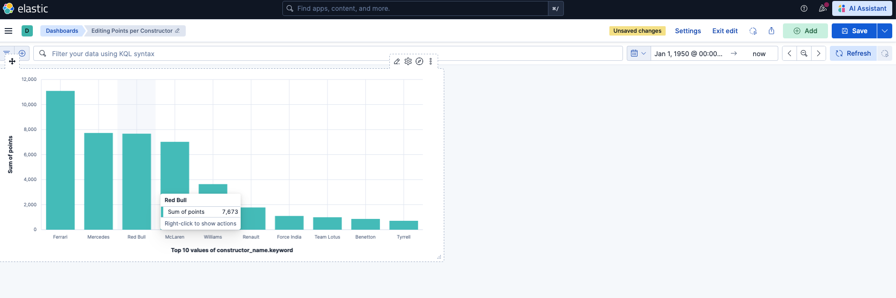
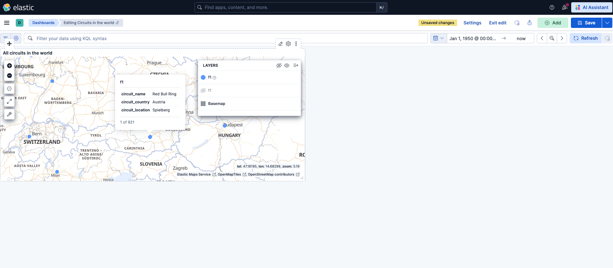

# F1 Elasticsearch
A practical of Elasticsearch using the Formula 1 Word Championship dataset (1950 - 2024).
The project indexes races results, driver data, constructor data and curcuit information in into elasticsarch
and demonstrates core features such as full-text-search, fuzzy search, filtering, 
bool queries and aggregations. A Kibana dashboard provides visual insights into the data.

## Requierments
- **Dataset:** Download the dataset from Kaggle https://www.kaggle.com/datasets/jtrotman/formula-1-race-data and 
pace it into ```/f1_dataset``` folder
- **Elasticsearch instance**
- **Kibana instance**

## Installation
To setup an elasticsarch instance with kibana for viusalisation - run the docker-compose script in this repository
```jsunicoderegexp
docker-compose.yml
```
1) Run command in terminal
```bash
docker compose up -d
```
2) Run ```docker ps``` to make sure that the elasticsarch and the kibana container is running
```bash
fabiankopf@MacBook-Pro-Fabian ElasticSearch % docker ps
CONTAINER ID   IMAGE                 COMMAND                  CREATED          STATUS          PORTS                                         NAMES
xxx   kibana:9.3.1          "/bin/tini -- /usr/l…"   11 seconds ago   Up 10 seconds   0.0.0.0:5601->5601/tcp, [::]:5601->5601/tcp   kibana
xxx   elasticsearch:9.3.1   "/bin/tini -- /usr/l…"   11 seconds ago   Up 10 seconds   0.0.0.0:9200->9200/tcp, [::]:9200->9200/tcp   elasticsearch
```
3)The Elasticsearch instance is available at http://localhost:9200 and the Kibana instance is available at http://localhost:5601

## Usage
### Indexing the data
To start off, the data in the ```/f1_dataset``` folder needs to be added. First run the indexing
script to create the Elasticsearch index and  load all documents
```
/ElasticSearch_F1/f1_dataset_inserter.py
```

```bash
python f1_dataset_inserter.py
```

This script performs the following steps:
- Loads all CSV files into pandas dataframe
- Merge them into a single flat structure (one document per race result)
- Creates the ```f1``` index in Elasticsearch with defined mapping
- Bulk indexes all documents

### Running example queries
To demonstrate the core features of Elasticsearch, run this python file
```
/ElasticSearch_F1/f1_queries.py
```
```bash
python f1_queries.py
```
This script demonstrates the following Elasticsearch query types:

| Query                   | Description                                         |
|-------------------------|-----------------------------------------------------|
| Full-text search        | Search races by name using tokenized text matching  |
| Fuzzy search            | Find drivers even when the name contains a typo     |
| Filter                  | Exact match one keyword field such as country       |
| Bool query              | Combine multible conditions using must and filter   |
| Terms aggregation       | Group and count results, e.g. wins per driver       |
| Sum aggregation         | Calculate totals, e.g. points per consturctur       |
 | Cardinality aggregation | Count distinct values, e.g. races per season        |
|Mutli-match search | Search a single term across multiple fields at once |

## Kibana Dashboard
Once the data is indexed, open Kibana at http://localhost:5601 and create a data view:
1. Go to Stack Management > Data Views
2. Create a new data view with index pattern ```f1``` and time field ```race_date```

Visualization with the dashboard:

The following visualizations were created in Kibana using the indexed F1 dataset:



---
**Wins per driver:**

Top 10 drivers ranked by total race wins across their entire F1 career, from 1950 to 2024. Michael Schumacher and 
Lewis Hamilton dominate the chart as the two most successful drivers in F1 history.



---
**Races per Season**

Number of individual races held per F1 season from 1950 to 2024. The chart clearly shows how the calendar has grown over
the decades, from around 7 races in the early 1950s to over 20 races in recent seasons.



---
**Driver Nationalities**

Distribution of all F1 drivers by nationality. British and American drivers make up the largest share, reflecting the 
historical roots of the sport in Europe and North America.



---
**Sum of points per Constructor**

Total championship points accumulated per constructor across all seasons. Teams like Ferrari, McLaren and Mercedes stand
out as the most successful constructors in the history of the sport.



---
**Map View of F1 Tracks**

World map showing the geographic location of every F1 circuit in the dataset, rendered using the geo_point field type 
defined in the Elasticsearch index mapping. The map illustrates the global reach of Formula 1, with circuits spread
across Europe, the Americas, Asia and the Middle East.



Note: When opening the dashboard for the first time, set the time range to an absolute range
from `1950-01-01` to `2024-12-31`, as the default time filter of "last 15 minutes" will return no results
for historical data.

---

## Key Elasticsearch Concepts Demonstrated
**Denormalization:** Instead of storing data across multiple relational tables, all relevant fields are merged into a
single flat document per race result. This is the standard approach in Elasticsearch and enables fast aggregations and searches
without expensive joins.

**Index mapping:** The mapping defines the data types of each field before indexing. Field types such as
```text```, ```keyword```, ```integer```, ```date``` and ```geo_point``` control how Elasticsearch stores and queries the data.

**Bulk indexing:** Documents are sent to Elasticsearch in batches of 500 using the bulk API, which is significantly more
efficient than indexing documents one by one.

**geo_point:** Storing circuit coordinates as ```geo_point``` allwos Kibana to render all circuits on an interactive world
map without any additional configuration.